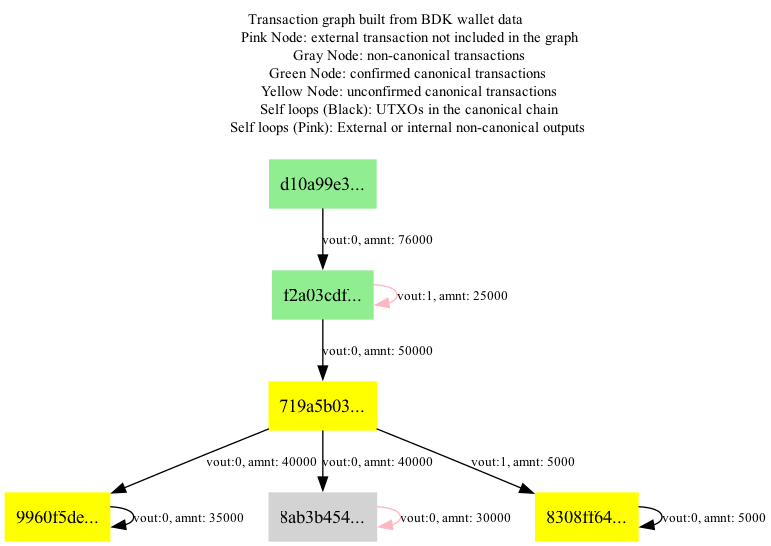

# Transaction Graph Visualizer for BDK Wallets

This is a simple tool to visualize the transaction graph of a bdk wallet. The repository currently contains a simple example containing most of the scenarios the visualizer covers.

- Canonical chain is represented with different colors
- Confirmed/unconfirmed transactions are represented with different colors
- External outputs are represented in the graph

<p align="center">
  <br>
  An example of a simple visualization of the transaction graph
</p>

---
Currently the only supported visualization is .dot for graphviz package. To export the images of the graphs please install graphviz.
For mac:
```bash
     brew install graphviz
```
For Ubuntu/Debian:
```bash
    sudo apt install graphviz
```
To run the example and see the corresponding graph run the following commands:
```bash
    brew install 
    cargo build 
    cargo --example simple
```